## This is a particularly lazy quick start guide to getting a Veilid Node running on the cheapest Linode possible with the least amount of steps and preferably no googling required. 

--------------------------------------------------------------------------------------------
### Requirements:
- 1 Linode Account (with credits or other currency to pay for the Linode)
- PuTTY (Windows Users Only)

### Optional But Recommended:
- Remmina (Linux Users Only) (For easy SSH management of a bunch of different cloud resources)

### Before We Begin:
I am setting up my Linode to require SSH keys for authentication (both for additional security and to minimize bot traffic). My host machine is a Fedora 38 system. If you are using Windows for SSH, you will likely want to use PuTTY and you will also likely want to create your SSH key with PuTTY. This is covered here. Please look for the "For Windows Users" section. I do not own a Mac and can not reliably emulate one, so there are no Mac specific instructions in this guide, at this time. If anyone wants to write those, please let me know, and i'll link those here. Finally, the reason setting a firewall is not listed in these hardening steps is, there is no documentation on which ports need to be enabled for the node to function properly, therefore setting a firewall is a bit out of the question as of now. This may change in the future. 

### FAQ: 

#### But why not <insert cloud hosting provider here>?
Linode is the cloud hosting provider I made my node on, so it is the cloud hosting provider that I have experience making nodes on. Outside of the uncertain ports required to function, I can't see a reason this would be incompatable with AWS, Google Cloud, or any other general cloud hosting provider. Of course, YMMV. 

### Additional Links and Documentation:

#### Veilid Official Website:
https://veilid.com/

#### Veilid's Gitlab:
https://gitlab.com/veilid/veilid

------------------------------------------------------------------------------------------
 Step 1: Log into your Linode Dashboard.
 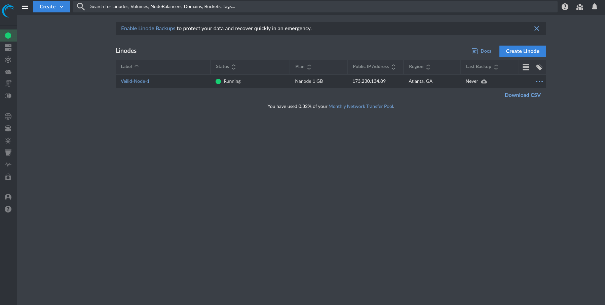

 Step 2: Click that giant "Create" button in the top left hand corner of the screen.
 

 Step 3: Select "Linode" from the drop-down menu.
 
 
 You will end up here:
 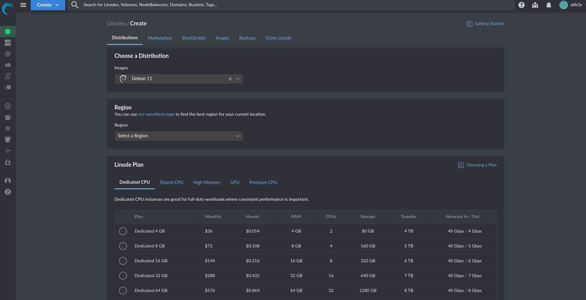

 Step 4: On the "Chose a Distribution" drop-down menu, pick "Debian 12". 
 

 - Why? In my testing Debian 10 and 11 both tried to fight me and Fedora had outdated packages in it's repos for Veilid. For ease of install, Debian 12 is the way to go here. 

Step 5: Select a Region. This really doesn't matter much so, pick something tropical? Pick your favorite city? Pick the funniest name? Eh. 


Step 6: Unless you want to spend the money for a nicer instance you're going to want to go with "Shared CPU"


 Step 7: And then select "Nanode 1 GB" ($5 USD a month)
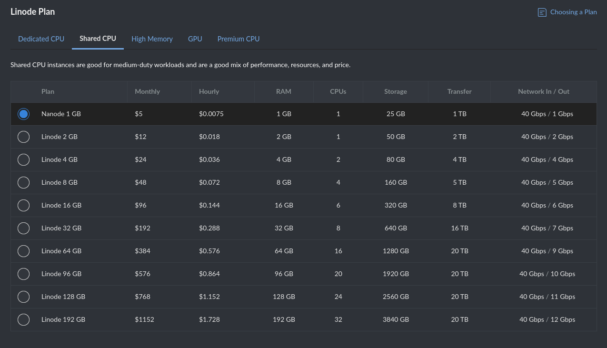

Step 8: Name it something cool (and add a tag if you like)


Step 9: Now it will ask you to set a root password. Given we are setting SSH keys, we will not be using this to authenticate to the Linode. However, it is still important to set a strong root password for obvious reasons. I mean a strong one. No no, not one you've used a million times. Nope, not that one either. A new, strong password that you won't reuse please.


## This is the beginning of the SSH Key section
Step 10: Now it is time to wrestle with the elephant in the room, SSH keys. Before you ask, yes I insist. Yes, this is "required". You could simply not use SSH keys but, it's 2023 and now is the time to make good security habits. I will not be covering the alternative in this guide. Use the SSH keys. Love the SSH keys.

I already have my SSH Key here, in my account, like a secure person. But assuming this is a new account, you will want to add an SSH Key. Please click the "Add An SSH Key" button now. 


Once you do, this "Add SSH Key" menu will appear on the right of your screen. The top slot is titled "Label" which is for naming your SSH key in case you have multiples. (Which you will, one for each instance. Right? At least one per each virtual network? No grevious reuse of SSH keys. Please, my little heart can't take it.) The bottom slot is for copying and pasting your SSH PUBLIC key into. Not your private key, THESE ARE DIFFERENT! Copying your private key into here will both keep you from being able to ever SSH into this Linode but it will also make you feel awfully dumb. No one likes to feel dumb. 


Of course we can't actually add an SSH key until we generate one, and of course we can't generate one until we understand PKI ... WAIT! Don't run! Please! I promise this will be short. SSH keys are asymmetric. This means that both keys are different and it requires both keys to make a connection. There is a public key and a private key. Keeping this short, they are both generated at the same time (by us, i'm geting to that), and using very complicated math the public key can check if the private key is the expected private key. If it is, then the connection is allowed. If not, then that private key is rejected and no SSH for you. 

Alright, so getting to generating these keys.

-----------------------

### Linux Users Here
Us Linux people (gnusers as I like to call us) have it easy. Just type the command ```ssh-keygen``` and you'll see something a bit like this (with less redactions): 
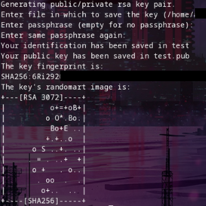

Once it's done you will have a hidden file named id_rsa which is located at ~/.ssh/id_rsa. In addition you will have a non-hidden file named id_rsa.pub. The hidden file is your private key, and the .pub file is your public key. Now all you have to do, assuming you left everything to default is enter the command ```cat ~/.ssh/id_rsa.pub``` Then copy and paste the entire thing starting with ssh-rsa and ending with <your username @ your hostname>. 

When done it will look a bit like this: 
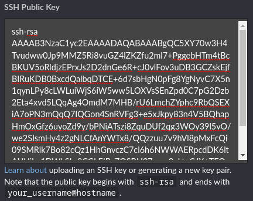

Then click "Add Key" and feel good about using SSH keys. Don't forget to click the check button next to your username when you're done!


-----------------------

### Windows Users Here
For all ya'll Windows users, you've got a bit more involved process. I am not a Windows user, but there is a wonderfully detailed guide here: https://www.ssh.com/academy/ssh/putty/windows/puttygen. In following this guide, once you get to the third screenshot you will see "Public key for pasting into OpenSSH authorized_keys file:" This is what you want to copy and paste. Alright, back to our regularly scheduled guide. 

------------------------

Step 11: Ignore all this other stuff. It will ask you if you want Add-ons, or a VLAN and nope, not for this guide, thanks. 
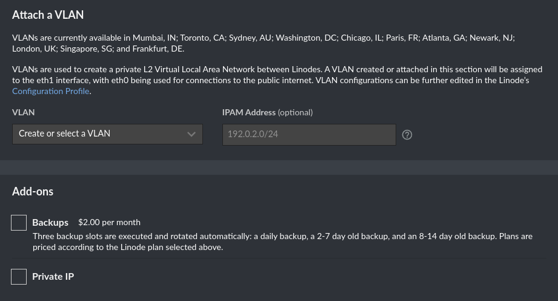

Step 12: Click the most satisifying button of all: "Create Linode"


Step 13: Now give it a minute to provision. Go to the bathroom or to get yourself a lovely cup of tea. This is usually pretty fast but, who doesn't need more tea? Once it's green you're good to SSH in. Just ignore the "Access" commands it gives you. We aren't about to use these anytime soon. We've got SSH keys. 


Step 14: Now that you've got a refill of your lovely beverage of choice and your Linode is ready to go we're going to connect to this Linode over SSH with SSH keys. This guide uses Remmina to create a connection profile so we can get away with remembering less stuff. Remmina is for Linux users only; all ya'll Windows people out there are going to have to use PuTTY. 

-------------------------------

### All My Linux People Here
Go ahead and open Remmina then click the little + on the top of the left corner of the window. 
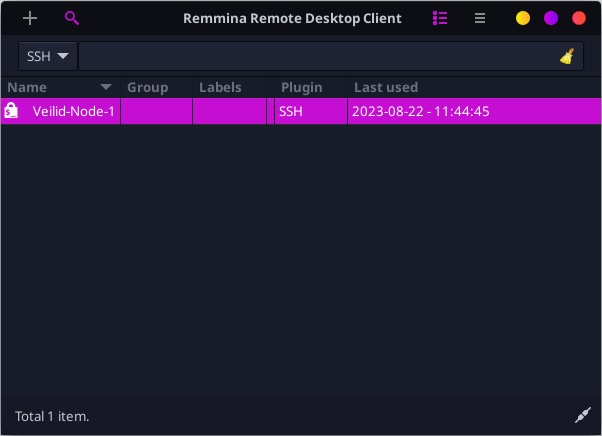

Change the protocol to "SSH - Secure Shell"


Now you'll see some more familiar options. 
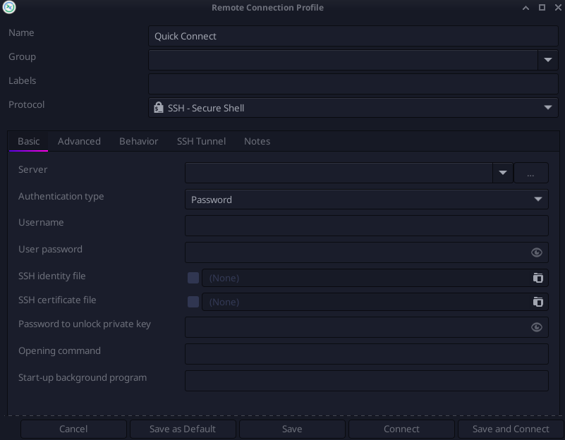

For Server type in your Linode's IPv4 Address (The top one under "IP Addresses" in the Linode website where we left off.)


Change the Authentication Type to "SSH identify file" so it will authenticate with our shiny new private key.


For Username, we're going to put "root" (all lower case, this is important), in here. Leave user password blank, where we're going, we don't need no stinking passwords!


Select the checkbox next to "SSH identity file" and then click the thing that looks way too much like an old printer but I think is supposed to be a folder. Then select your SSH private key from the file browser. You may need to right click and select "show hidden files" if you are running anything close to what I am. It has to be your private key. Remember that SSH keys are asymmetric and we just used our public key to create the server. Now we use the private key. Leave everything else blank (unless you did set a passphrase for your key, then you'd enter it in "password to unlock private key" but, we didn't this time, just to keep things simple.) It should look a bit like this: 
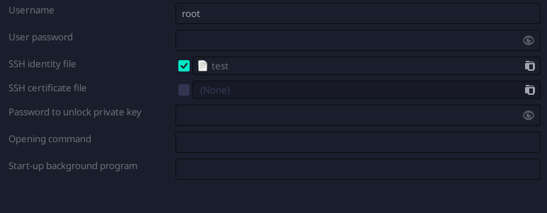

Then click "Save and Connect" and you're in! You've just made and connected to a Linode!

------------------------------

### For the Windows People
As I said before, I don't use Windows but, this guide should help. https://devops.ionos.com/tutorials/use-ssh-keys-with-putty-on-windows/ . Now back to our normally scheduled guide.

------------------------------

Step 15: We're finally to go the good stuff, actually installing Veilid. The hard part is over, I promise. If you follow the install instructions from the official website, they'll give you a bit of grief because Linode does not have gnupg installed on debian by default for some reason. So we need to do that first. Run the following commands:

```apt-get update```

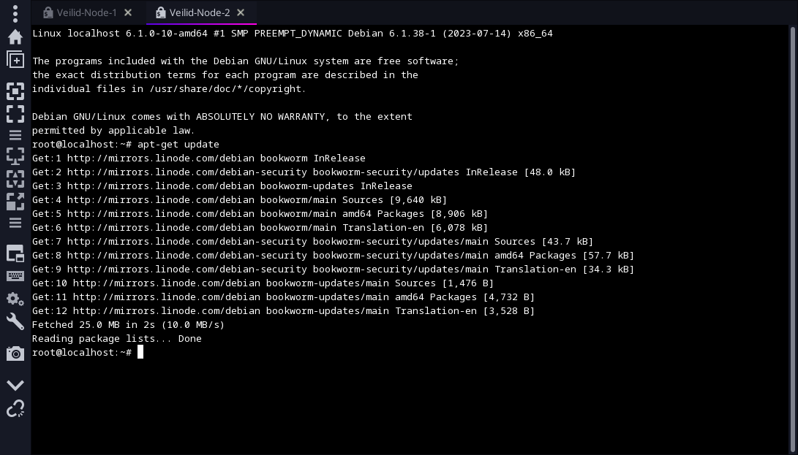

Then run:

```apt install gnupg -y```

(Crappy life pro tip, you can use -y to skip the "y" required when it asks if you're sure you want to install this stuff. This is great for scripting but terrible for actually knowing what you're installing as well as all the depedencies.)


Step 16: Just like the website says, run the following command to add a GPG key to the system's keyring so the Veilid repo can be verified. (Yep, that's right, more asymmetric keys. :))

```wget -O- https://packages.veilid.net/gpg/veilid-packages-key.public | sudo gpg --dearmor -o /usr/share/keyrings/veilid-packages-keyring.gpg```


Step 17: Add the Veilid repos to apt with the following command. You will not get a response from the system once this is done and that's okay.:

```
echo "deb [arch=amd64 signed-by=/usr/share/keyrings/veilid-packages-keyring.gpg] https://packages.veilid.net/apt stable main" | sudo tee /etc/apt/sources.list.d/veilid.list 1>/dev/null
``` 

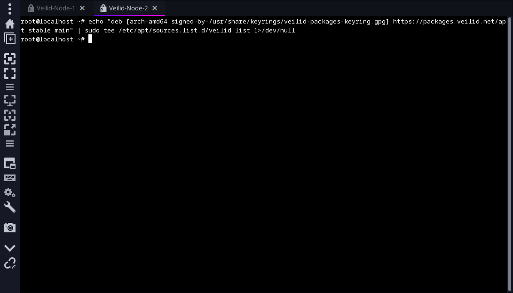


Step 18: Run apt update again to refresh the package manager with:

```apt update```


Step 19: Now we finally get to install Veilid with the following command:

```apt install veilid-server veilid-cli -y```

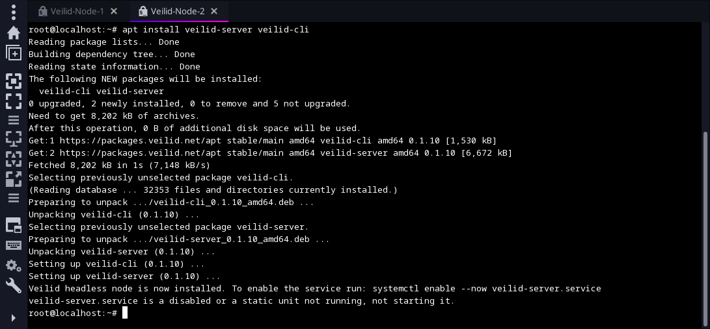

Step 20: Now to both run the server and make sure it starts upon boot enter the following command:

```systemctl enable --now veilid-server.service```


Step 21: To see all this hard work pay off enter the following command:

```veilid-cli```


Cool isn't it? If you get "bootstrap server could not be contacted" errors, give it up to 15 minutes. That happened on several of my nodes and it always sorted it's self out. That's it! Congrats! You're now the proud parent of your very own Linode hosted Veilid Node! 

----------------------------------------------------------------------------------------------------
